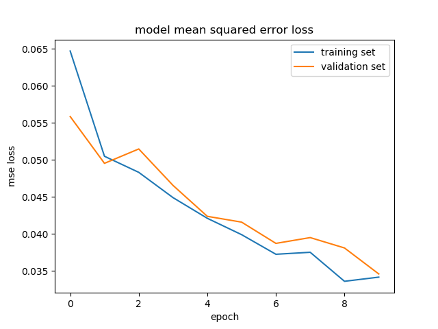

# **Behavioral Cloning**


**Behavioral Cloning Project**

The goals / steps of this project are the following:
* Use the simulator to collect data of good driving behavior
* Build, a convolution neural network in Keras that predicts steering angles from images
* Train and validate the model with a training and validation set
* Test that the model successfully drives around track one without leaving the road
* Summarize the results with a written report


### Files Submitted & Code Quality

#### 1. Submission includes all required files and can be used to run the simulator in autonomous mode

My project includes the following files:
* model.py containing the script to create and train the model
* drive.py for driving the car in autonomous mode (This is provided [Udacity](https://github.com/udacity/CarND-Behavioral-Cloning-P3/blob/master/drive.py), my modification was to increase the car speed on line 47 from 9 to 12)
* model.h5 containing a trained convolution (nvidia model) neural network
* writeup.md summarizing the results

#### 2. Submission includes functional code
Using the Udacity provided simulator and my drive.py file, the car can be driven autonomously around the track by executing 
```sh
python drive.py model.h5
```

#### 3. Submission code is usable and readable

The model.py file contains the code for training and saving the convolution (nvidia model) neural network. The file shows the pipeline I used for training and validating the model, and it contains comments to explain how the code works.

### Model Architecture and Training Strategy

#### 1. An appropriate model architecture has been employed

My first approach was to use the [LeNet model](http://yann.lecun.com/exdb/lenet/), but it was hard to have the car inside the street with 3 epochs (this model could be found [here](model.py#L123-L136)). Even with 10 epochs it was not good. See all my models and attempts [here](models/). I used the EC2 instance with GPU because the training on CPU was extremely slow.
After that, I decided to try the [NVidia Autonomous Car Group model](https://devblogs.nvidia.com/parallelforall/deep-learning-self-driving-cars/) and the car drove the complete first track after just 5 training epochs (this model could be found [here](model.py#L139-L154)). For the second track 5 epochs was not enough. So I increased to 7 and finally to 10 epochs. With 10 epochs and many training images with driving forward and backward, the vehicle could stay on the track.


#### 2. Attempts to reduce overfitting in the model

I decided not to modify the model by applying regularization techniques like [Dropout](https://en.wikipedia.org/wiki/Dropout_(neural_networks)) or [Max pooling](https://en.wikipedia.org/wiki/Convolutional_neural_network#Max_pooling_shape). Instead, I decided to keep the training epochs low (not more than 10 epochs). Furthermore the model was trained and validated on different data sets to ensure that the model was not overfitting.
In addition to that, I split my sample data into training and validation data. Using 80% as training and 20% as validation.


#### 3. Model parameter tuning

The model used an Adam optimizer, so the learning rate was not tuned manually ([model.py line 191](model.py#L191)).

#### 4. Appropriate training data

Training data was chosen to keep the vehicle driving on the road. Also, the data provided by Udacity, I used the first track and second track data ([model.py line 158](model.py#L158)). The simulator provides three different images: center, left and right cameras. Each image was used to train the model.

For details about how I created the training data, see the next section. 

### Model Architecture and Training Strategy

#### 1. Solution Design Approach

My first approach was to use the LeNet](http://yann.lecun.com/exdb/lenet/) model with 3 and finally with 10 epochs and the training data provided by Udacity. On the first track, the car went straight to the lake. I needed to do some preprocessing [model.py line 113-120](model.py#L113-L120). A `Lambda` layer was introduced to normalize the input images to zero means. Furthermore a  `Cropping` layer was used. The results improved, but was not perfect even with 10 epochs.

The second step was to use the [NVidia Autonomous Car Group model](https://devblogs.nvidia.com/parallelforall/deep-learning-self-driving-cars/) The only modification was to add a new layer at the end to have a single output as it was required. This time the car did its first complete track, but there was a place in the track where it passes over the "dashed" line. I increased the epochs from 5 to 10 and collect more data.  Augmented the data by adding the same image flipped with a negative angle([model.py line 104](model.py#L104)). In addition to that, the left and right camera images where introduced with a correction factor 0.2 on the angle to help the car go back to the lane([model.py line 60 - 74](model.py#L60-L74)). At the end of the process with using 10 epochs, the vehicle was able to drive autonomously around the track 1 and finally on track 2 without leaving the road.


#### 2. Final Model Architecture

The final nvidia model, see [model.py line 139 - 154](model.py#L139-154).

Model architecture summary:

```
Layer (type)                     Output Shape          Param #     Connected to
====================================================================================================
lambda_1 (Lambda)                (None, 160, 320, 3)   0           lambda_input_2[0][0]
____________________________________________________________________________________________________
cropping2d_1 (Cropping2D)        (None, 90, 320, 3)    0           lambda_1[0][0]
____________________________________________________________________________________________________
convolution2d_1 (Convolution2D)  (None, 43, 158, 24)   1824        cropping2d_1[0][0]
____________________________________________________________________________________________________
convolution2d_2 (Convolution2D)  (None, 20, 77, 36)    21636       convolution2d_1[0][0]
____________________________________________________________________________________________________
convolution2d_3 (Convolution2D)  (None, 8, 37, 48)     43248       convolution2d_2[0][0]
____________________________________________________________________________________________________
convolution2d_4 (Convolution2D)  (None, 6, 35, 64)     27712       convolution2d_3[0][0]
____________________________________________________________________________________________________
convolution2d_5 (Convolution2D)  (None, 4, 33, 64)     36928       convolution2d_4[0][0]
____________________________________________________________________________________________________
flatten_1 (Flatten)              (None, 8448)          0           convolution2d_5[0][0]
____________________________________________________________________________________________________
dense_1 (Dense)                  (None, 100)           844900      flatten_1[0][0]
____________________________________________________________________________________________________
dense_2 (Dense)                  (None, 50)            5050        dense_1[0][0]
____________________________________________________________________________________________________
dense_3 (Dense)                  (None, 10)            510         dense_2[0][0]
____________________________________________________________________________________________________
dense_4 (Dense)                  (None, 1)             11          dense_3[0][0]
====================================================================================================
Total params: 981,819
Trainable params: 981,819
Non-trainable params: 0
```

#### 3. Creation of the Training Set & Training Process

Addionally to the data provided by udacity (data/01_udacity), I collected and used the following data [model.py line 158](model.py#L158):

Track 1
- Some (5-6) laps driving forward (data/02_track1_forward)
- Three laps driving backward (data/03_track1_backward)

Track 2
- Two laps driving forward. That was not enough data to stay on the whole track (data/04_track2_forward)
- Four additionally laps driving forward (data/05_track2_forward). Four laps on track 2, was challenging for me :)

All these data was used for training the model with 10 epochs. The data was shuffled randomly. The following picture shows the training:



After this training, the car was driving down the road all the time on the [first](video_track1.mp4) and [second](video_track2.mp4) track.
